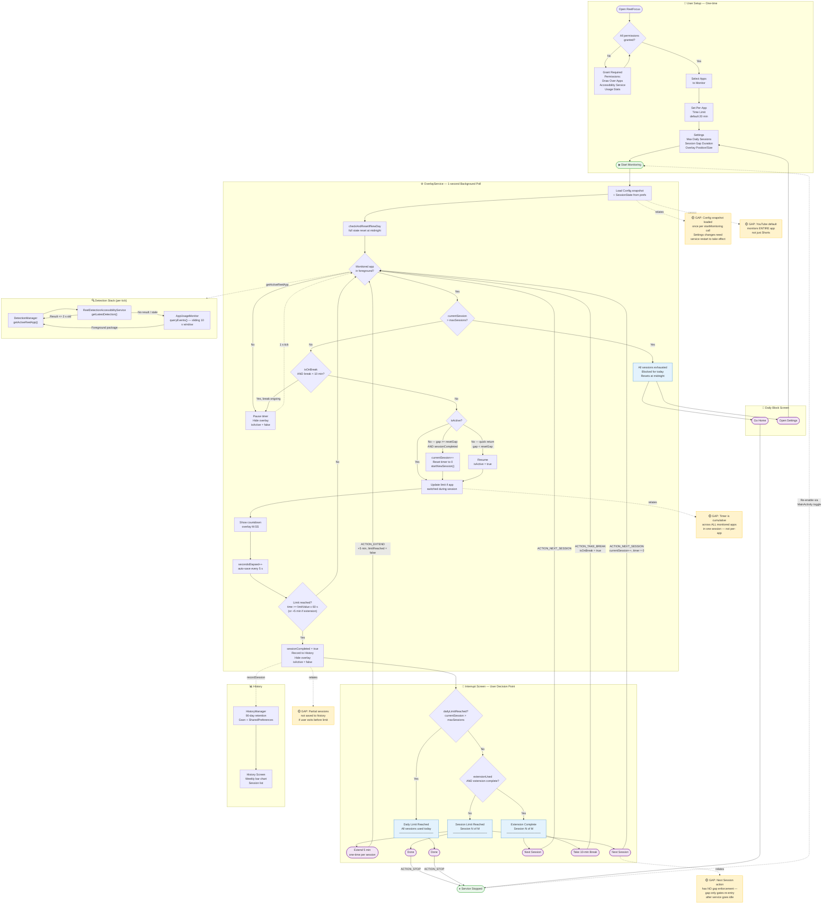

# ReelFocus — Functional Flow Diagram

> **How to read this diagram**
> - **Solid arrows** → normal runtime flow
> - **Dashed arrows** → background / persistence calls
> - **🟡 Gap nodes** → open functional questions / potential changes needed

---

## Functional Gaps Summary

| # | Gap | Impact | Suggested Fix |
|---|-----|--------|---------------|
| G1 | Partial sessions (user exits before limit) are **not recorded** in history | History understates actual usage | Record session on `handleMonitoredAppInactive` when `secondsElapsed > 0` with `completed = false` |
| G2 | Timer is **cumulative across all monitored apps** in a session, not per-app | Opening Instagram for 10 min then YouTube for 10 min counts as 20 min total — may surprise users | Clarify in UI, or make timer per-app and track separately |
| G3 | "Next Session" button has **no gap enforcement** — user can tap it immediately | Gap rule is only enforced on re-entry after the service goes idle, not on the interrupt screen | Either disable the button for `sessionResetGapMinutes` minutes, or start a mandatory cooldown |
| G4 | Config loaded **once per `startMonitoring()` call** — settings changes while service runs are ignored | Changing app list or time limits requires stopping and restarting the service | Reload config each tick (lightweight), or send a `ACTION_RELOAD_CONFIG` intent to the service |
| G5 | YouTube default entry monitors the **entire YouTube app**, not just YouTube Shorts | Penalises users watching regular YouTube | Use Accessibility Service's `ReelPatternMatcher` to detect Shorts-specific UI; already wired in via BUG-008 fix |
